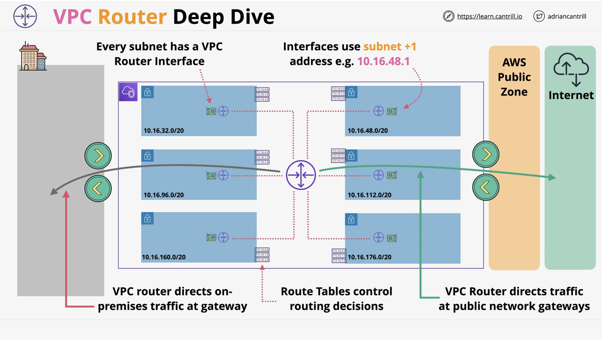
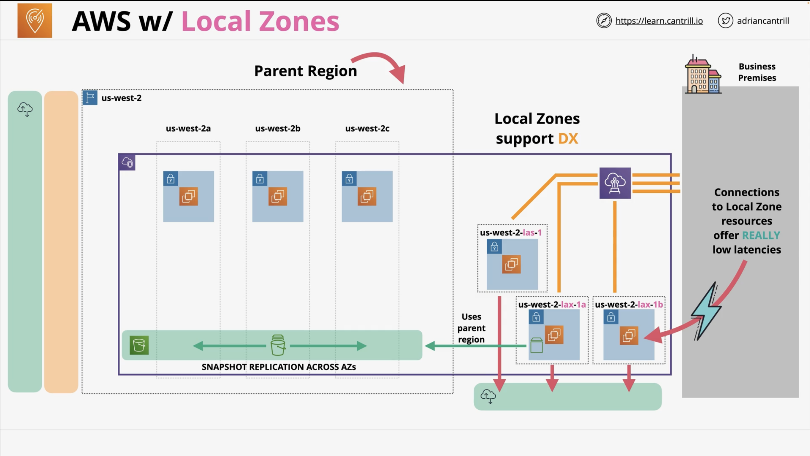
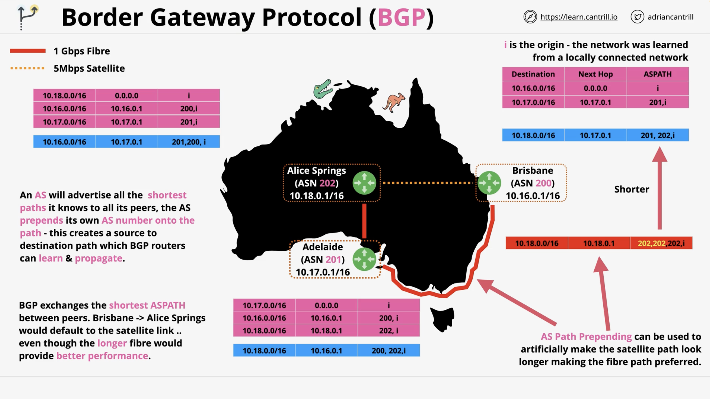

# Networking Concepts

## 1. VPC Router Deep Dive
Network gateway Objects (transit gateway or virtual private gateway) ensure VPC traffic reaches to On-prem network.



- Every VPC is created with a **Main Route Table**
- **default** for every subnet in the VPC
- _custom route tables_  can be created and associated with subnets in the VPC - removing the Main RT.
- _Subnets_ are associated with One RT (Main or Custom)
- RT's can be associated with gateways.


## 2. AWS w/ Local Zones
- They are additional zone. No built in resilience.
- They are like an AZ but near your location. So lower latency.
- DX to a local zone is supported (extreme performance needs)
- Utilise parent region for control plane operations. (EBS snapshots are to parent)
- Use local zones when you need the "HIGHEST" performance.




## 3. Border Gateway Protocol (BGP)
It is a system made up of a lots of self managing network known as AS (Autonomous System). It could be a large network or a large collection of router. And it is generally controlled by one entity.



---

- `ASN (Autonomous System Number)` are unique 16-bit or 32-bit numbers allocated by IANA `(0-65535) [Public number]` vs range`(64512-65534) [Private number]`.
- Private number are used in **Private Peering** arrangement, these numbers are the identifiers of different entities within the network.
- BGP distinguish between different network using these ASN.
- BGP operates over `tcp/179` and peering is manually configured between two different autonomous systems.
- Now those `two autonomaous systems` can communicate and learn about networks from any of the peering relationships.
- Now those two ASNs can learn about networks from any of the peering relationships.
- This builds up a larger BGP network ---> Each individual AS is exchanging network topology
>Boom this is the internet from routing perspective.
- BGP is a `path-vector protocol` = Exchanges the best path to a destination between peers.
    - The path is called `_ASPATH_`
- `iBGP` = Internal BGP {Routing within an AS}
- `eBGP` = External BGP {Routing between different ASNs}

---

- All Locations or `AS` will have their their peering connection configured via table mentioned.
- When peered with another `AS` they exchange or pre-pends routes along with corresponding `ASNs`. All, possible paths to reach a destination are appended in route tables.
- We can artificially increase the length of `ASPATH` by pre-pending `ASNs` to a route. This is called **AS-Path Prepending**.

---


## How BGP Route Exchange Works

Each Autonomous System (AS) maintains a routing table. When two ASes peer (over `tcp/179`), they **exchange** their known routes along with the `ASPATH` — the ordered list of ASNs a packet must traverse to reach a destination.

---

## Example Topology

```
AS 200 ——— AS 201 ——— AS 202
  \                      /
   \                    /
    ——— AS 203 ————————
```

- **AS 200** — `120.0.0.0/16`
- **AS 201** — `50.0.0.0/16`
- **AS 202** — `80.0.0.0/16`
- **AS 203** — `100.0.0.0/16`

---

## Route Tables (per AS)

### AS 200

| Destination      | ASPATH            | Next Hop |
|------------------|-------------------|----------|
| `50.0.0.0/16`   | AS 201            | AS 201   |
| `80.0.0.0/16`   | AS 201, AS 202    | AS 201   |
| `80.0.0.0/16`   | AS 203, AS 202    | AS 203   |
| `100.0.0.0/16`  | AS 203            | AS 203   |
| `100.0.0.0/16`  | AS 201, AS 202, AS 203 | AS 201 |

> BGP selects the **shortest ASPATH** as the best path. To reach `80.0.0.0/16`, both paths have length 2 — a tiebreaker (e.g., lowest next-hop AS, MED, local pref) decides.

---

### AS 201

| Destination      | ASPATH            | Next Hop |
|------------------|-------------------|----------|
| `120.0.0.0/16`  | AS 200            | AS 200   |
| `80.0.0.0/16`   | AS 202            | AS 202   |
| `100.0.0.0/16`  | AS 202, AS 203    | AS 202   |
| `100.0.0.0/16`  | AS 200, AS 203    | AS 200   |

---

### AS 202

| Destination      | ASPATH            | Next Hop |
|------------------|-------------------|----------|
| `50.0.0.0/16`   | AS 201            | AS 201   |
| `120.0.0.0/16`  | AS 201, AS 200    | AS 201   |
| `120.0.0.0/16`  | AS 203, AS 200    | AS 203   |
| `100.0.0.0/16`  | AS 203            | AS 203   |

---

### AS 203

| Destination      | ASPATH            | Next Hop |
|------------------|-------------------|----------|
| `120.0.0.0/16`  | AS 200            | AS 200   |
| `50.0.0.0/16`   | AS 200, AS 201    | AS 200   |
| `50.0.0.0/16`   | AS 202, AS 201    | AS 202   |
| `80.0.0.0/16`   | AS 202            | AS 202   |

---

## AS-Path Prepending (Traffic Engineering)

If **AS 200** wants to discourage traffic from arriving via **AS 201**, it can **prepend its own ASN** multiple times when advertising to AS 201:

### Before Prepending (AS 202's view)

| Destination      | ASPATH            |
|------------------|-------------------|
| `120.0.0.0/16`  | AS 201, AS 200    |
| `120.0.0.0/16`  | AS 203, AS 200    |

> Both paths are length 2 — either could be selected.

### After AS 200 Prepends to AS 201

AS 200 advertises `120.0.0.0/16` to AS 201 as: `AS 200, AS 200, AS 200`

| Destination      | ASPATH                      |
|------------------|-----------------------------|
| `120.0.0.0/16`  | AS 201, AS 200, AS 200, AS 200 |
| `120.0.0.0/16`  | AS 203, AS 200              |

> Now the path via AS 203 (length 2) **wins** over the inflated AS 201 path (length 4). Traffic to `120.0.0.0/16` shifts to the AS 203 link.

---

## Key Takeaways

- BGP is a **path-vector protocol** — it selects best path based on shortest `ASPATH`.
- Every AS **pre-pends its own ASN** to routes before advertising them to peers.
- **AS-Path Prepending** artificially lengthens a path to influence inbound traffic flow.
- All possible paths are stored in the table; only the **best path** is used for forwarding.

---

## 4. AWS Global Accelerator
It starts with two `Any Cast IP Addresses` (1.2.3.4 and 4.3.2.1). It allows a single IP to be advertised from multiple locations. Routing moves traffic to closest location.
