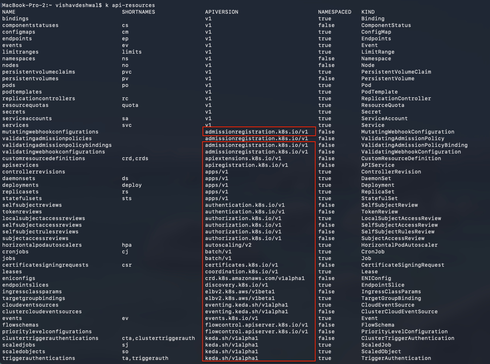
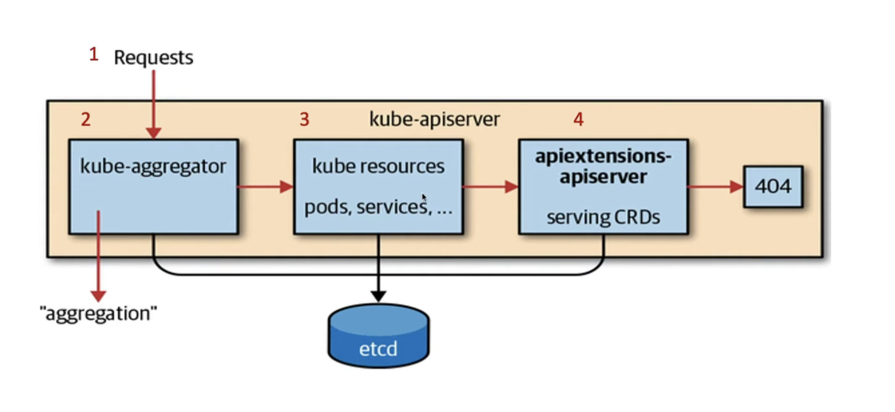

# Custom Resources

Custom Resources (CRs) are extensions of the Kubernetes API that allow you to define your own custom objects. They are used to extend the functionality of Kubernetes and to manage custom resources that are not built into Kubernetes.

Red marked = API Endpoint groups, when we type commands like `kubectl get pods` we are using the `v1` API endpoint group. If we are doing `kubectl get daemonsets`, then we are using `apps/v1` API endpoint group.

---

---

`Kube Aggregator` = It is a component of _kube-apiserver_ and sits in front of **API Service** object. It routes requests for **_registered extension API groups_**. For built-in resources like deployments, pods, services etc., those go straight to the main **kube-apiserver**. For Custom resources, we have to register them to the `Aggregator`.

---

**Resource**
- A resource is an endpoint in the `Kubernetes API` that stores a collection of `API Objects`.
- Example: `apps/v1` = is an API Endpoint group
- Deployment, DaemonSet, StatefulSet, ReplicaSet, Pod, Service, ConfigMap, Secret, Namespace, Node are all resources = and they are API Objects.

**Custom Resource**
- They are the `User Defined` resources and are the `extension` of the existing Kubernetes API.
- Resources which are not available by default.
- Once custom resource is created ---> Can be accessed using `kubectl get <custom-resource-name>`.
    - Once it is created ---> It will provide a **`declarative API`**.

**Definition**
- Declarative commands to `API Server` is in the form of YAML Construct.
- It allows you to define custom resources.
- Once CR (Custom Resource) is created. It creates a new `<Custom Controller>` on resource handling `create/update/delete events`.
- 